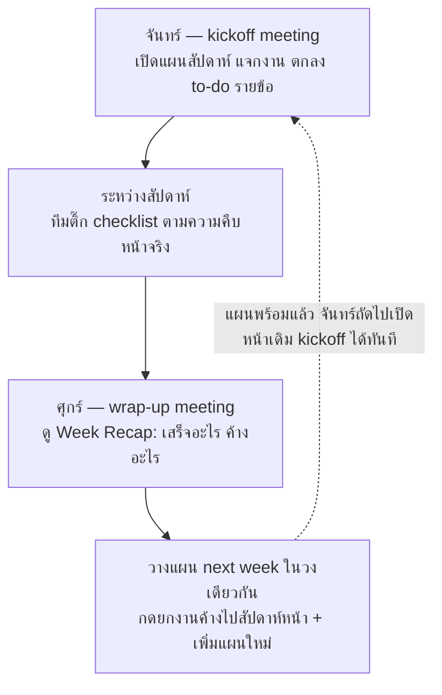

# Weekly Plan v2 — Checklist, Week Recap, Meeting Notes

> เอกสารนี้เขียนไว้ให้ AI developer (Sonnet 5) อ่านแล้วลงมือทำต่อได้ทันที
> **อ่าน `docs/DEV-PLAN.md` หัวข้อ "ข้อตกลงของโปรเจกต์นี้" ให้จบก่อนเริ่มทุกครั้ง** — สรุปข้อที่พลาดแล้วเจ็บที่สุด:
> - DB Neon ตัวเดียวใช้ทั้ง dev และ production — แก้ข้อมูลตอน dev = แก้ production จริง
> - **ห้ามใช้ `prisma migrate dev`** — schema change ต้องเขียน SQL มือใส่ `prisma/manual-migrations/` แล้วรันตรงด้วย psql (backup CSV ก่อนเสมอ)
> - วันที่ที่เขียน/เทียบกับ DB ต้องเป็น UTC เสมอ (`Date.UTC(...)`) — ดู `normalizeWeekStart` ใน `lib/weeklyPlan.ts` เป็นแบบอย่าง
> - หลัง `npx prisma generate` ต้อง stop + start dev server ใหม่ (module cache จะถือ client เก่า)
> - เสร็จทุกงาน: `npx tsc --noEmit` ผ่าน → ทดสอบจริงใน browser ทั้ง day/night mode → commit → push

---

## เป้าหมาย (ภาพรวมสำหรับสื่อสารกับทีมได้ด้วย)

หน้า Weekly Plan (`/weekly-plan`) ถูกใช้เป็นศูนย์กลางของ 2 ประชุมประจำสัปดาห์:



ปัจจุบันหน้านี้เห็นแค่ "หัวข้อ task" ต่อสัปดาห์ — v2 เพิ่ม 3 อย่าง:

| # | Feature | ใช้ตอนไหน |
|---|---------|-----------|
| F1 | **Checklist ย่อยในแต่ละ task** — to-do ติ๊กได้รายข้อ พร้อมตัวนับ 2/4 | จันทร์แจกงาน / ระหว่างสัปดาห์อัปเดต / ศุกร์ไล่ดูว่าค้างข้อไหน |
| F2 | **Week Recap + ปุ่ม "ยกไป next week"** — สรุปเสร็จ/ไม่เสร็จอัตโนมัติ กดปุ่มเดียวยกงานค้างไปสัปดาห์หน้า | ประชุมศุกร์ |
| F3 | **Meeting notes ผูกกับสัปดาห์** — ช่องโน้ตแยก จันทร์ (kickoff) / ศุกร์ (wrap-up) ย้อนดูได้ | ทั้งสองประชุม |

---

## สถาปัตยกรรมเดิมที่ต้องรู้ (อ่านไฟล์จริงประกอบ)

- `prisma/schema.prisma` — มี `WeekPlan` (unique ที่ `weekStart` = Monday 00:00 UTC) และ `WeekPlanItem` (มี `status: pending|done|carried_over`, `carriedFromId`, `sourceRefId`)
- `lib/weeklyPlan.ts` — หัวใจของระบบ:
  - `normalizeWeekStart(param)` แปลง "YYYY-MM-DD" → UTC Monday ของสัปดาห์นั้น
  - `getOrCreateWeekPlan(weekParam)` — สร้างแผนครั้งแรกแบบ lazy: gen auto items + **copy รายการ `carried_over` จากสัปดาห์ก่อนหน้าเข้ามาให้ (เติม prefix `↻ ` ที่ title, เซ็ต `carriedFromId`)**
  - `syncAutoItems(weekParam)` — เติม auto item ที่ขาด (dedup ด้วย `sourceRefId`) **ห้ามให้ sync ไปแตะ/ลบ checklist ที่ผู้ใช้สร้าง**
- API เดิม: `GET /api/weekly-plan?week=`, `POST /api/weekly-plan/sync?week=`, `POST /api/weekly-plan/items`, `PUT|DELETE /api/weekly-plan/items/[id]`
- UI เดิม: `app/weekly-plan/WeeklyPlanClient.tsx` (layout: ซ้าย 2 คอลัมน์ = EditablePlanItems + งานแทรก, ขวา 1 คอลัมน์ = ProjectHealthTable), `components/weekly-plan/EditablePlanItems.tsx` (การ์ด task + ปุ่มสถานะ Pending/Done/Carry Next Week)
- สไตล์: Tailwind v4 tokens (`var(--color-*)` ใน `app/globals.css`) — **มี dark mode แล้ว ห้าม hardcode สี ต้องใช้ token เสมอ** ไอคอน lucide-react เท่านั้น

---

## Schema changes

เพิ่มใน `prisma/schema.prisma`:

```prisma
model WeekPlan {
  // ...ของเดิม...
  kickoffNotes String?   // โน้ตประชุมจันทร์
  wrapupNotes  String?   // โน้ตประชุมศุกร์
}

model WeekPlanItem {
  // ...ของเดิม...
  checklist WeekPlanChecklistItem[]
}

model WeekPlanChecklistItem {
  id         String       @id @default(cuid())
  planItem   WeekPlanItem @relation(fields: [planItemId], references: [id], onDelete: Cascade)
  planItemId String
  text       String
  done       Boolean      @default(false)
  sortOrder  Int          @default(0)
  createdAt  DateTime     @default(now())

  @@index([planItemId])
}
```

ไฟล์ SQL: `prisma/manual-migrations/add_weekly_plan_v2.sql` (ตาม convention ไฟล์อื่นในโฟลเดอร์นั้น):

```sql
ALTER TABLE "WeekPlan" ADD COLUMN "kickoffNotes" TEXT;
ALTER TABLE "WeekPlan" ADD COLUMN "wrapupNotes" TEXT;

CREATE TABLE "WeekPlanChecklistItem" (
    "id" TEXT NOT NULL,
    "planItemId" TEXT NOT NULL,
    "text" TEXT NOT NULL,
    "done" BOOLEAN NOT NULL DEFAULT false,
    "sortOrder" INTEGER NOT NULL DEFAULT 0,
    "createdAt" TIMESTAMP(3) NOT NULL DEFAULT CURRENT_TIMESTAMP,

    CONSTRAINT "WeekPlanChecklistItem_pkey" PRIMARY KEY ("id")
);

CREATE INDEX "WeekPlanChecklistItem_planItemId_idx" ON "WeekPlanChecklistItem"("planItemId");

ALTER TABLE "WeekPlanChecklistItem" ADD CONSTRAINT "WeekPlanChecklistItem_planItemId_fkey"
    FOREIGN KEY ("planItemId") REFERENCES "WeekPlanItem"("id") ON DELETE CASCADE ON UPDATE CASCADE;
```

ขั้นตอนรัน: backup `WeekPlan` + `WeekPlanItem` เป็น CSV ไป scratchpad ก่อน → `set -a && source .env && set +a && psql "$DATABASE_URL" -f prisma/manual-migrations/add_weekly_plan_v2.sql` → verify → `npx prisma generate` → restart dev server

---

## F1 — Checklist ย่อยในแต่ละ task

### API
| Method | Route | Body | ทำอะไร |
|--------|-------|------|--------|
| POST | `/api/weekly-plan/checklist` | `{ planItemId, text }` | สร้างข้อใหม่ (`sortOrder` = max ของ item นั้น + 1) ตอบ record ที่สร้าง |
| PUT | `/api/weekly-plan/checklist/[id]` | `{ text?, done? }` | แก้ข้อความ / ติ๊ก-ยกเลิกติ๊ก |
| DELETE | `/api/weekly-plan/checklist/[id]` | — | ลบข้อ |

และแก้ `lib/weeklyPlan.ts` ให้ทุกจุดที่ `include: { items }` เปลี่ยนเป็น `include: { items: { orderBy: { sortOrder: "asc" }, include: { checklist: { orderBy: { sortOrder: "asc" } } } } }` เพื่อให้ `GET /api/weekly-plan` ส่ง checklist มาด้วยใน payload เดียว (ไม่ต้องยิงเพิ่ม)

### UI (แก้ `components/weekly-plan/EditablePlanItems.tsx`)
ในการ์ดแต่ละ task (component `ItemRow`):
- แถวหัว checklist: ตัวนับ `2/4` + mini progress bar (สูง ~4px, สี `var(--color-accent)`, พื้น `var(--color-surface)`) — ซ่อนทั้งแถวถ้ายังไม่มี checklist
- รายการ checklist: checkbox + ข้อความ ข้อที่ done ขีดฆ่า + สี `var(--color-text-muted)` / ข้อค้างสี `var(--color-text-primary)` — ติ๊กแล้ว optimistic update ทันที ค่อยยิง PUT ตามหลัง (pattern เดียวกับ `handleUpdate` เดิมใน `WeeklyPlanClient`)
- แถวท้าย: input inline "+ เพิ่ม to-do…" (Enter = save, blur ว่าง = ไม่สร้าง) + ปุ่มลบ (icon `Trash2` ขนาด 12) โผล่ตอน hover ของแต่ละข้อ
- Checklist แสดงตลอด (ไม่ต้องพับ) — task ในสัปดาห์นึงมีไม่กี่รายการ พับแล้วเสียมากกว่าได้

### Data flow
`WeeklyPlanClient` ถือ `items` state อยู่แล้ว — ขยาย type `PlanItem` ให้มี `checklist: ChecklistItem[]` แล้วส่ง handler `onChecklistAdd/Toggle/Delete` ลงไปให้ `EditablePlanItems` (ทำแบบเดียวกับ `onUpdate/onDelete` เดิม)

---

## F2 — Week Recap + ยกไป next week

### API ใหม่: `POST /api/weekly-plan/items/[id]/carry`
ยกรายการที่ไม่เสร็จไปสัปดาห์หน้า **แบบ eager** (สร้างให้เห็นทันที ไม่รอ lazy copy):
1. โหลด item + weekPlan ของมัน → คำนวณ `nextWeekStart = addDays(weekStart, 7)` (weekStart ใน DB เป็น UTC Monday อยู่แล้ว — บวกวันเฉยๆ ห้ามสร้าง Date ใหม่จาก local time)
2. `getOrCreateWeekPlan` ของสัปดาห์หน้า (ใช้ฟังก์ชันเดิม — ส่ง param เป็น `toDateParam` ของ nextWeekStart แบบ UTC)
3. **กัน duplicate**: ถ้าในแผนสัปดาห์หน้ามี item ที่ `carriedFromId === id` อยู่แล้ว → ตอบตัวเดิม ไม่สร้างซ้ำ
   (สำคัญ: เคสที่เกิดจริงคือ user กดปุ่มสถานะ "Carry Next Week" ไว้ก่อน แล้วแผนสัปดาห์หน้าถูกสร้างขึ้น (lazy copy ทำงาน) แล้ว user มากดปุ่ม "ยกไป next week" ใน recap ซ้ำอีก)
4. สร้าง item ใหม่ในแผนสัปดาห์หน้า: copy field ตาม pattern lazy carry ใน `getOrCreateWeekPlan` (title เติม prefix `↻ ` ถ้ายังไม่มี, เซ็ต `carriedFromId`, `sortOrder` = max + 1)
5. **Copy checklist เฉพาะข้อที่ยังไม่ done** ไปเป็น checklist ของ item ใหม่ (`done: false`) — ข้อที่เสร็จแล้วอยู่เป็นประวัติที่สัปดาห์เดิม
6. เซ็ต item ต้นทาง `status = "carried_over"`
7. ตอบ `{ carriedItem, nextWeekStart }`

### UI ใหม่: `components/weekly-plan/WeekRecap.tsx`
วางใต้ `EditablePlanItems` ในคอลัมน์ซ้าย (เหนือกล่องงานแทรก) เป็นการ์ดสไตล์เดียวกับการ์ดอื่น (`bg var(--color-card)`, border `var(--color-border)`, rounded-xl):
- หัวการ์ด: "Week Recap — ใช้ในประชุมศุกร์" + สรุปตัวเลขขวา: `เสร็จ X/Y (Z%) · งานแทรก Nh` (คำนวณจาก `items` state + `weekInterruptHours` ที่มีอยู่แล้วใน `WeeklyPlanClient` — ไม่ต้องยิง API เพิ่ม)
- รายการเสร็จ (`status === "done"`): icon `Check` สีเขียว (`var(--color-rag-green)`) + title ขีดฆ่าจางๆ
- รายการไม่เสร็จ (`status === "pending"`): icon `X` สีแดง (`var(--color-rag-red)`) + title + **ปุ่ม "ยกไป next week →"** (ปุ่ม border เล็กๆ) — กดแล้ว: ยิง carry API, เปลี่ยน status ใน state เป็น `carried_over`, และเพิ่มเข้า preview สัปดาห์หน้า
- รายการที่ carry แล้ว (`status === "carried_over"`): icon `RotateCcw` สีเหลือง (`var(--color-rag-amber)`) + label "→ ไป next week แล้ว" (ปุ่มหาย)
- เส้นคั่น แล้วส่วน "แผน next week (วันที่ช่วงหน้า)": โหลด `GET /api/weekly-plan?week=<nextMonday>` ตอน mount (หมายเหตุ: การเรียกนี้สร้างแผนสัปดาห์หน้าถ้ายังไม่มี — by design) แสดง title รายการแบบย่อ รายการที่มี `carriedFromId` ติด badge `carry` (พื้น `var(--color-rag-amber-light)` ตัวหนังสือ `var(--color-rag-amber-text)`) + input "+ เพิ่มแผนสัปดาห์หน้า…" (ยิง `POST /api/weekly-plan/items` ด้วย `weekPlanId` ของสัปดาห์หน้า)
- แสดง Recap เฉพาะเมื่อดูสัปดาห์ปัจจุบันหรือย้อนหลัง — ถ้ากำลังดูสัปดาห์อนาคต ไม่ต้องแสดง (กัน recursive confusion)

---

## F3 — Meeting notes ผูกกับสัปดาห์

### API: `PUT /api/weekly-plan/notes`
Body `{ weekPlanId, kickoffNotes?, wrapupNotes? }` — update เฉพาะ field ที่ส่งมา ตอบ plan ที่อัปเดตแล้ว
(`GET /api/weekly-plan` ตอบ `kickoffNotes`/`wrapupNotes` มาอยู่แล้วหลังแก้ schema — เช็คว่า serialize ครบ)

### UI ใหม่: `components/weekly-plan/MeetingNotes.tsx`
การ์ดใต้ WeekRecap: หัว "Meeting Notes" + grid 2 ช่อง (`sm:grid-cols-2`):
- ช่องซ้าย label "จันทร์ — kickoff" / ช่องขวา label "ศุกร์ — wrap-up"
- textarea สไตล์ input เดิมของแอป (ดู `inputStyle` ใน `EditablePlanItems.tsx`) `minHeight ~72px`, placeholder "บันทึกสรุปประชุม + สิ่งที่ตกลงกัน…"
- **Autosave แบบ debounce 800ms** หลังหยุดพิมพ์ + save ตอน blur — มี indicator เล็กๆ "บันทึกแล้ว ✓" (จางหายใน ~2s) มุมขวาของหัวการ์ด
- เปลี่ยนสัปดาห์ (WeekNav) แล้ว notes ต้องโหลดของสัปดาห์นั้น — ผูกกับ `loadPlan` เดิม อย่าลืม reset state ตอน week เปลี่ยน (กัน notes สัปดาห์เก่าค้างแล้วเซฟทับสัปดาห์ใหม่ — **บั๊กที่ต้องระวังสุดใน F3**: debounce ที่ pending อยู่ต้อง cancel ตอน week เปลี่ยน)

---

## กับดักที่รู้แล้ว (อย่าพลาดซ้ำ)

1. **UTC เท่านั้น** — ทุก Date ที่ไป DB: ใช้ util เดิม (`normalizeWeekStart`, `addDays`, `toDateParam`) ห้าม `new Date(y, m, d)` local
2. **Sync ต้องไม่แตะ checklist** — `syncAutoItems` เพิ่มเฉพาะ item ที่ขาด ไม่ update/ลบ item เดิม (พฤติกรรมเดิมถูกแล้ว แค่อย่าไปเปลี่ยน)
3. **Carry dedup** — เช็ค `carriedFromId` ก่อนสร้างเสมอ (รายละเอียดใน F2 ข้อ 3)
4. **Lazy carry เดิมยังทำงานอยู่** — อย่าลบ logic ใน `getOrCreateWeekPlan` (มันคือ fallback สำหรับคนที่กดปุ่มสถานะ Carry โดยไม่ผ่าน recap) — แต่ให้ lazy copy พา **checklist ข้อที่ยังไม่ done** ไปด้วยเหมือน eager carry จะได้ consistent
5. **Dark mode** — ทุกสีใหม่ต้องเป็น `var(--color-*)` ทดสอบทั้งสองโหมดก่อน commit (สลับได้จากปุ่มพระจันทร์/พระอาทิตย์บน navbar)
6. **หลัง prisma generate ต้อง restart dev server** — ไม่งั้นเจอ `Cannot read properties of undefined (reading 'findMany')`

---

## Acceptance criteria

**F1 Checklist** — ✅ เสร็จแล้ว (commit `351a85d`)
- [x] เพิ่ม/ติ๊ก/แก้/ลบ to-do ในแต่ละ task ได้ ตัวนับ + progress bar อัปเดตทันที (optimistic)
- [x] Refresh หน้าแล้ว checklist ยังอยู่ครบ ลำดับถูก
- [x] กด Sync Auto Items แล้ว checklist ที่มีอยู่ไม่หาย
- [x] ลบ task แล้ว checklist ของมันหายตาม (cascade)

**F2 Recap + Carry** — ✅ เสร็จแล้ว (commit `bd43f08`)
- [x] ตัวเลขสรุป เสร็จ X/Y (Z%) ตรงกับสถานะจริงของ items
- [x] กด "ยกไป next week" → รายการไปโผล่ในแผนสัปดาห์หน้า (title มี `↻ `, มี badge carry) + รายการต้นทางเปลี่ยนเป็น carried_over + checklist ข้อค้างตามไป ข้อเสร็จไม่ตาม
- [x] กดซ้ำ / กดหลังเคยกดปุ่มสถานะ Carry ไว้แล้ว → ไม่เกิดรายการซ้ำในสัปดาห์หน้า
- [x] เพิ่มแผนใหม่ให้สัปดาห์หน้าจาก recap ได้ แล้วกด WeekNav ไปสัปดาห์หน้าเห็นรายการตรงกัน
- [x] ดูสัปดาห์อนาคตอยู่ → ไม่แสดง Recap

**F3 Meeting notes** — ✅ เสร็จแล้ว (commit `78e9dd0`)
- [x] พิมพ์แล้วหยุด ~1s ขึ้น "บันทึกแล้ว ✓" refresh แล้วโน้ตยังอยู่
- [x] เปลี่ยนสัปดาห์ไป-กลับ โน้ตแสดงถูกสัปดาห์ ไม่เซฟทับข้ามสัปดาห์
- [x] จันทร์กับศุกร์แยกกันอิสระ

**ทั่วไป**
- [ ] `npx tsc --noEmit` ผ่าน
- [ ] ทดสอบจริงใน browser ครบทั้ง day และ night mode
- [ ] Commit แยกตาม feature (F1 / F2 / F3) message อธิบาย why, push แล้ว Vercel deploy ผ่าน
